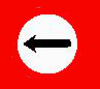

### Finding the Signs
First thing I needed was some means to detect the outer edge of the signs, given
the vast spread of color, a technique such as kmeans would not have been effective,
as there wasn't a few dominant colors in the image.
I decided the best approach would be back projection as I could take samples from
the target images and then find all the variations of the red with a sufficiently
varied sample set, which is shown below.


I needed to take the red from these signs and compress it into a image that could
be histogramed and fed into the backprojection opencv call, so I created the
BackProjectionPacker class. This returned a "packed" version of the png:

|Original | Packed |
|:-------:|:---------------:|
||

Then taking the images, I apply this back projection and dilate by one to ensure
I get all the rings as closed loops:

|Original | Back Projected |
|:-------:|:---------------:|
| | |

|Original | Back Projected |
|:-------:|:---------------:|
||

The see the second back projection missed one parking sign in the
distance, it is too small to get by this method, as the pixels are not clearly defined.

|Original | Back Projected |
|:-------:|:---------------:|
||

|Original | Back Projected |
|:-------:|:---------------:|
||

|Original | Back Projected |
|:-------:|:---------------:|
||


### Filtering the Regions
By applying a threshold close to 0 I got many defined regions on each image. The next task was to find the connected components by opencv's findContours method. This still resulted in many regions. To filter efficiently I applied a series of rules:

1. The region must have a child region

		hierarchy[:contourId][2] >= 0

2. The region must have no parent

		hierarchy[:contourId][3] < 0

3. Given the region has children the area of at least one child must be over 200
	pixels.

This resulted in much fewer regions of interest needing further processing.


### Extracting the features
The next task was given a region likely to be a sign, to extract a clean set of object pixels I could do some template matching against.

I create a mask for the area covered by the regions child regions with an area over 200 pixels. The regions under this are ignored. I then extract the white or black pixels with various thresholds and inversions in those regions and resize the region covered by the mask to 60px x 60px (this is the area of the center of our sign templates) and give it a white border to give the template room to try slight off matching.


|Image 1|---|---|---|---|---|
|---|---|---|---|---|---|---|
|Black Pixels||||||
|White Pixels|||||||


|Image 2|---|---|---|---|
|---|---|---|---|---|---|
|Black Pixels|||||
|White Pixels|||||


|Image 3|---|---|---|---|---|
|---|---|---|---|---|---|---|
|Black Pixels||||||
|White Pixels||||||


|Image 4|---|---|---|---|---|
|---|---|---|---|---|---|---|
|Black Pixels||||||
|White Pixels||||||
|Black Pixels||||||
|White Pixels||||||


|Image 5|---|---|---|---|---|
|---|---|---|---|---|---|
|Black Pixels||||||
|White Pixels||||||
|Black Pixels|||||
|White Pixels|||||

### Matching

|Straight|Right|Left|No Straight|No Right|No Left|Parking|No Parking|Yield|
|:------:|:---:|:--:|:---------:|:------:|:-----:|:-----:|:--------:|:---:|
||||||||||

Above is my templates, they will be decomposed into their white and black object pixels, ignoring the red section.

In hindsight I believe I should have
used SPR on the black object pixels and the number of white panels (e.g. straight - 1 panel, no-straight - 2+ panels). However I used chamfer matching which caused many problems but all of which I solved in this case, but had I to do this again I would not probably not have used chamfer matching.


#### Chamfer Matching Problem #1 : Different Ranges
The value of the chamfer match is a function of the number of object pixels in the template, i.e. the value of the match of one template could output a much larger value just due to the fact it has more object pixels to check. This resulted in me having to define "normalisation divisors". I had to generate these one at a time, my goal was to use the divisors to get all the numbers in the same range so that if one match gave a lower number than the other after the divisor had been applied. While this resulted in correct results for these images, due to the limited supply of test data, they would be unlikely to be robust across other images.
```c
vector<KnownSign> knownSigns {
	KnownSign("known_signs/left.png", 90, 30),
	KnownSign("known_signs/no_left.png", 65, 85),
	KnownSign("known_signs/no_parking.png", 35, 80),
	KnownSign("known_signs/no_right.png", 65, 85),
	KnownSign("known_signs/no_straight.png", 55, 30),
	KnownSign("known_signs/parking.png", 75, 45),
	KnownSign("known_signs/right.png", 90, 30),
	KnownSign("known_signs/straight.png", 90, 30),
	KnownSign("known_signs/yield.png", 70, 20)
};
```

Above is the constructors for my templates showing the normalisation divisors for the white and the black object pixels, respectively.

#### Chamfer Matching Problem #2 : Sub-Objectness
Due to chamfer matching working by trying to find the distance to object pixels in an image given a template, if we are given an object such as the black pixels of the straight arrow, and we match it to the black pixels of a parking sign, we get a near perfect match, probably better than the parking sign template. So we get this issue that if template As object pixels are a subset of Bs object pixels the chamfer match returns a near perfect match. To alleviate this problem I do 2 chamfer matches and take the maximum of them after they have been normalised, this removes the subset issue.

#### Chamfer Matching Problem #3 : Still didn't work
Even with the first two problems solved the chamfer match still could not determine whether it was a no-parking sign or a 50km/h sign, so I had to resort to SPR in the end to separate the comparisons enough that my double chamfer match could figure it out. I only compared objects with 1 panel to templates with 1 panel and 2+ panels with 2+ panels. This finally gave the seperation I needed and I had a solution. (Not the most elegant).

#### Qualification
In the end, I tuned the normalisation divisors that they would at least accept all true positives yielding an output of less than 10, I tuned it to be as close to 10 to try and distinguish them. Then due to the solution presented in problem #2, I took the max, generally yielding a poor result for negatives (as one would be poor even when subobjectness would become an issue in the other) and via my tuning always under 10 for positives. Any remaining issues would be ironed out by the panel comparison and apart from the small parking sign missed by the backprojection, I successfully identify all signs.

### Results


### 2 True Positives, 1 True Negative

### 1 True Positive, 1 False Negative, 2 True Negatives

### 3 True Positives, 1 True Negative

### 9 True Positives, 1 True Negative

### 9 True Positives, 1 True Negative

## Total: 24 True Positives, 1 False Negative, 6 True Negatives

**Precision** = TP / ( TP + FP ) = 24/24 = **100%**

**Recall** = TP / ( TP + FN ) = 24/25 = **96%**

**Accuracy** = ( TP + TN ) / ( TP + TN + FP + FN ) = ( 24 + 6 ) / ( 24 + 6 + 0 + 1 ) = **97%**

**Specificity** = TN / ( FP + TN ) = 6 / ( 0 + 6 ) = **100%**

**F-Measure** = 2TP / ( 2TP + FP + FN ) = 48 / ( 48 + 0 + 1 ) = **98%**
